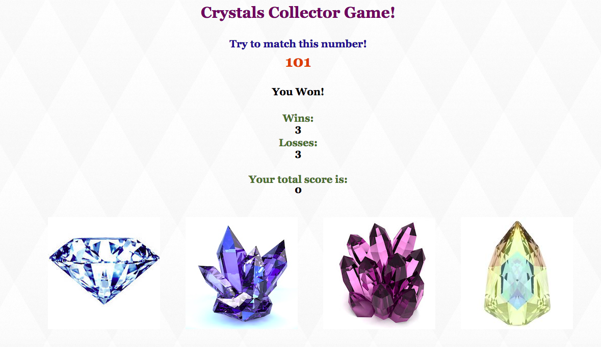

# CrystalsCollector-Game
Assignment_CrystalsCollector-Game

# Link to deployed site
https://lalatw.github.io/CrystalsCollector-Game/


# Images


# Technology used
* html
* css
* javascript
* jQuery


# Code snippets


```

    $("#randomnum").text(randomNumber);
    console.log (randomNumber);

    $("#crystal01").on("click", function() {
        totalScore += crystal01;
        toUpdate();
        console.log (totalScore);

    });


```


# Learning points
* Use javascript along with jQuery to add or change the desired behavior of web page.
* Use jQuery click event to triger game start and score calculation.
* Apply variables to store data values.
* Apply "if, else" to specify conditional statements.


# Author 
[Shuhan Laura Lee](https://lalatw.github.io/CrystalsCollector-Game/)

* Portfolio : https://lalatw.github.io/Responsive-Portfolio/


# License
Standard MIT License
